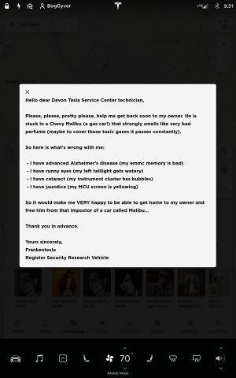

# Tesla Service Center Frustration

## Tesla Service Center Events

### August 2020 - 2nd Issues with EMMC

**07/27/2020 - CID goes black**

On 07/27/2020, as I was returning home, my central display started to be very sluggish in reacting to my commands... It happens sometimes as it is just a big computer run by a NVIDIA processor. So when I get home, I use the steering wheel buttons to do a normal reboot (done many times, maybe one a week recently). Usually within a minute it comes back up and all is fine... well... not this time... after about 5 minutes of nothing happening I decide to go in the house and have dinner. I come back hours later and the screen is still black. I reboot it again... Now it's like 9pm and getting dark, and you can see that the computer is stuck in a cyclic boot: the screen backlight goes on and off. Oh well, this is a two years old computer and I had to go through the same exercise in April 2018. Back then Tesla had the car in service for 40 (forty) days. And in the end they told me they put a new CID. Well, I've learned later (once I got my way inside the car's computers) that it was NOT a new one how they claimed, it was actually manufactured some time in 2016 and most likely was in another car before (back then there was a shortage of this part at Tesla).

So, not my first battle and nothing to panic about. I go on the Tesla App (it's so nice to be able to schedule stuff without having to call) and pick August 11th as the first available date for the Tesla Ranger to come to my house and fix it (I do love this feature also, when they come and fix it at your place). Anyway, I set it and start wondering what I'm going to do all this time without the car. Well, one can drive it, but the central display also control the AC, and driving in a hot and humid Philly day without AC in July is not fun. So I put my Security Researcher (aka white hacker) hat on, get access to the central computer and find the issue... the file system is corrupted. Good, cause Tesla has two.... and the only way I know how to switch them is to do a software redeploy... so I do that and 3 hours later the car is back online!

But... when I start going through the logs I see even this partition has signs of data corruption. So will keep the appointment.

**08/07/2020 - Remote troubleshooting**

It is standard operating procedure for Tesla to have their tech remote into a car to gather more information before an appointment. This helps to get all the data needed so they have all the parts and items needed to fix your car very fast... or at least that's the plan.

So I start getting texts from a technician... he is trying to get inside my car but he does not have much success... I tell him that some of the errors are clean because I switched the EMMC banks. That's when I lost him.**What do you mean?**he asks.**Your vehicle is not showing faulty EMMC errors at this time.**I explained that I am a registered Security Researcher and that I happen to have access to my car's computers and that I do have screenshots of the logs full of errors. I also explained to him how I switched banks by redeployment. He tells me this is nothing that a Tesla Ranger can fix and I have to get my car in for service. He offered 8/10/2020 (a day earlier than the Ranger visit) and a Uber ride home. I explain to him I can not be without the car and that the car is "kind of" fixed and would rather bring it in when they have a loaner. He tells me that 8/25 is the first day they will have a loaner for me. I say OK. And tell him that if it gets worse, I will try to change the appointment.

**08/08/2020 - The logs**

Today I get a text from the technician that he was able to pull the logs and he indeed sees memory corruption messages (on the "good" memory bank). He also sees that my storage is low (an issue I've been having, and other owners too, since the upgrade to version 2020.24.6.11). I tell him yes, the**syslog**gets full because it is not rotated and fills up the whole**/var**partition. I also tell him I cleared it 4 days ago and it's almost full. So we leave it that this has to be done on 8/25/2020. OK. At least they know all the parts they need and from previous personal experience the whole process is way less than 2 hrs...

**Service Day 1**

- 8:30 AM - Drop my car to the Tesla Service Center in Devon PA per my appointment. I try to park up front but I'm asked to double park it in any open spot. Knowing this will go fast (oh, how wrong is to assume) I left it close by, blocking 3 other cars that were there for service. Few other people were dropping cars the same way, so I said they will move it if they need to...
- 8:32 AM - Technician goes inside the vehicle and performs an MCU reboot. 40 seconds. This timestamp will be on the IC for quite some time. Then he goes with me over what I had in my file. I mention that I have two other items: with the rain the previous night, I get water in the liftgate and the left tail light shows condensation. Also I show him that I have bubbles on the IC screen, so most likely that will have to be replaced. I have extended warranty until 10.2022 so not a big deal, correct? I was wrong again.
- 8:35 AM - Technician starts to be fairly mean. Like I'm bothering him. Man, it's just early in the morning what is he going to do the whole day? He explains to me how these items are not on the ticket he has. Like it was my fault it rained the night before. And he truly believed it.
- 8:40 AM - Technician finally goes inside to get the paperwork I need to sign... On the way towards inside he tells me that he doesn't know when I'm getting a loaner, because they are out... You can feel in his voice that it gave him pleasure telling me that. Like he still had the upper hand. He is the king of that service center. I can't just throw items his way any time I feel like...
- 8:50 AM - It's getting south FAST... He comes up with the paperwork, showing the original two items I had on the ticket and the total deductible per my warranty, which is $200. Then he shows me the other two items I brought up today and he perceives to tell me (again, with great internal pleasure, cause he's making more money for Tesla) that EACH of the items is going to cost me 87.50. (wonder where they came up with these numbers...). I am whatever, I'll not gonna fight him now or maybe he's gonna reschedule me in December... He knows he has the power to and he even has a smirk on his face.
- 9:15 AM - I finally get my loaner.... I am late for a meeting and tired of dealing with people... It's a Chevy Malibu.... a CHEVY ... MALIBU... at a Tesla dealership... what, are they trying to get me to switch back to gas? They even want for me to pay for extra insurance... I'm like ... it's not my car... they pay for it.. it's their problem... I get inside and leave...
- 9:18 AM - Is it the perfume from the enterprise lady that dropped the car or what... at my meeting I leave the windows cracked... can't wait for the end of the day to get my car back (yeah right).
- 11:00 AM - Nope... car smells the same way... cheap perfume somebody used a lot to cover some worse smell and by the time I get home I already have a migraine...
- 11:15 AM - I take it to [twitter](https://twitter.com/BogdanButoi/status/1298278413246050304?s=20) as the frustration with the customer support person, the extra charges and the loaner are getting to me.
- 12:55 PM - After I checked my notes and the discussions I had with the Tesla online technician at the beginning of August I get even more frustrated. The date was switched from 8/10 to 8/25 so that I can be guaranteed a loaner. On 8/10 they offered to Uber me home... So back to [twitter](https://twitter.com/BogdanButoi/status/1298302679266004992?s=20)I go
- 2:00 PM - I look on the Tesla App on my phone and guess what: the car did not move... So I log in remotely and take snapshots of the instrument cluster (IC) and the central display (CID)... nothing has changed since I dropped my car in the AM... there is still time to finish it...
- 4:25 PM - Another check on car location and status shows that it is still there, not changed, not touched... so it take it to [twitter](https://twitter.com/BogdanButoi/status/1298356150883229696?s=20) again in frustration
- 9:15 PM - After dinner, I check again on the car. Nope, nobody, not even remotely, came to look at the car to start fixing it... Lost day... Let's try to make the technician smile, I am sure many people like me get frustrated with them and that can't be easy on them. So I remote into the car and display a funny letter on the central display. Then I post it on [twitter](https://twitter.com/BogdanButoi/status/1298428231247437824?s=20)

**Service Day 2**

- 8:00 AM - Let's look, maybe something did happen overnight from the Tesla HQ team... nope... my love note is still there on the CID and car did not move... still shows the 8:32 AM time when it was last turned on on 08/25... I am sure they will get to it today.
- 12:00 PM - No changes in location... what is going on? So these 4 cars (mine and the 3 I'm blocking) have not been accessed in 30 hrs (at least)
- 3:00 PM - 2 hrs to go until they close... Maybe I should open a betting line on FanDuel... Odds are nobody will bet on the car being finished today... Even though last time I took the MCU out from a Model S to replace it on an out-of-warranty car it only took 30 minutes...
- 5:00 PM - It's official, day 2 passed and nothing happened...
- 5:12 PM - Too frustrated I take to it [twitter](https://twitter.com/BogdanButoi/status/1298730801283112961?s=20)... I know it's not Elon's fault but this customer support sucks! I have stocks, I am a Tesla Fan, I have my tri-motor CyberTruck on order... I just need to feel that I will be taken care off...
- 6:30 PM - Take my son to soccer... Oh, the SMELL!!! Open the windows to get some fresh air but it's humid outside. Can't win today!

**Service Day 3**

- 8:00 AM - Maybe today is the day. Maybe today they will look at my car and I can take it back.
- 9:00 AM - I had to drive to a client and 3 minutes in the drive the headache came back from the weird smell in this rental car...
- 11:00 AM - Car is in the same spot... nobody touched it... nobody even opened a door... my monitors did not detect any remote access from a Tesla HQ employee either...
- 2:30 PM - This is getting frustrating again... I feel I should press the horn button on the remote to get somebody to pay attention to my baby. It's been there for 54 hrs without even being moved to better parking spot.
- 4:30 PM - Was it really moved??? Is it that or just a glitch in the GPS showing me the car now 5 ft to the left... I need to grab some screenshots quickly from IC and CID... Exciting times... YES IT DID... for 1 minute.... I bet that they just needed one of the 3 cars i was blocking... It moved from blocking 3 on the left to blocking 3 on the right...

**Service Day 4**

- 3:07 PM - NOTHING changed... same position ... untouched... still there...

- 5:00 PM - Another 10 ft move... at least now it's parked in a parking spot, not just blocking other cars... yet 4 days I could have drove my car because definitely Tesla tech don't have time for my car even though it was scheduled 3 week prior to the appointment...
- 6:00 PM - Just got home after driving the Malibu for an hour... Unfortunately it was raining so i could not keep the windows open. Got the headache about 30 min into my 1 hour drive... I'm really starting to think if it's from whatever they use to disinfect for COVID. Whatever that chemical is, it stinks and gives me headaches....