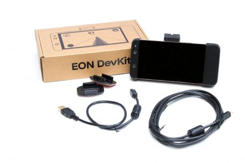

# EON

```
The original EON is not supported in the latest releases of software from OpenPilot. The Tinkla Unity software will not run on the original EON. You can still find some old versions of OpenPilot for Tesla (v0.6.6 and v0.7.4) but you will not be able to take advantage of the newer features. Also the EON requires the EPAS harness to work on preAP Tesla Model S.
```

The EON is the name associated in the Comma.ai community to the device that sits in your windshield and does all the calculations for LKA and ACC.



## EON DevKit (or FrEON)

The EON is based on the [Qualcom Snapdragon 821 mobile platform](https://www.qualcomm.com/products/snapdragon-821-mobile-platform?cmpid=snfyus19642&gclid=EAIaIQobChMI-oG8if364QIVFY_ICh0DFArXEAAYASAAEgKFL_D_BwE&gclsrc=aw.ds). Phones like OnePlus 3T or LeEco LePro3 have been used to create the FrEON (the free EON). You can find some instructions [here](https://medium.com/@kirk_40929/getting-comma-openpilot-running-on-a-used-phone-c72d609cb4d3).

If you choose to buy your [EON](https://comma.ai/shop/products/eon-gold-dashcam-devkit) already made, you can do so from Comma.ai store for $599 USD.

Also, as we run more and more processing on the EON, it gets hotter and hotter. Some of us have opted to replace the original fan (which is also noisy when you're inside of a Tesla) with super quiet [Noctua fans](Noctua_fan.md). $15 from Amazon and soldering two wires and you're good to go! We might have to actually double that to two [Noctua fans](Noctua_fan.md) in the near future.

Also, keeping the phone screen off helps keeping the temperature low. I know, in the beginning one wants to see those lines matching the lines in the video, but after a while you stop paying attention to the screen. And if you have the IC integration all the data is on IC anyway. So turn that screen off and you will see the temperature drop about 15F.

Code for power management of battery (only charging when below 60% and stopping the charge when it reaches 80%) has helped keep the battery temperature lower and hence the CPU cooler. And this is a free upgrade, as the code is already in my repo.

Here is a helpful [EON bash profile](EON_bash_profile.md)(.bash_profile).

## Installing the EON

EON installation is pretty simple. Your main objective is to ensure the EON is level with the ground, and pointed as straight as you can get it. If you're uncomfortable "eyeballing it," you may want to use:

- A measuring tape
- A roll of masking tape
- A friend to help

### Instructions

1. Find a place at the bottom of the windshield, along the driver's side pillar that has a similar position on the passenger side (such as the place where the corner of the front hood meets the fender).
2. With the tape starting from that point, mark 3 places along the side of the windshield. Use the edge of the masking tape to mark them. I personally used 3" from the bottom, the top of the windshield and then about 1/3 from the bottom, 2/3 from the top. It does not matter what the measuring tape says, as long as it says the SAME distance on driver's and passenger's sides.
3. Repeat the process on the other side of the windshield, ensuring you mark the same spots.
4. measure the distance between one edge of the windshield and the other end, keeping the tape at each pair of marked points from before. use masking tape to mark the middle of the windshield. again, use the EDGE of the tape, not the center.
5. Now use a long piece of masking tape to mark the center of the windshield from top to bottom. This (if you did everything correctly) will cover all 3 of your markers from before and provide a straight line. One edge of the masking tape is now the perfect middle of the windshield. Your mount will have to be aligned with that for a perfect position.
6. Take a small piece of tape and mark the middle of the GoPro mount. use a slightly longer piece than the go-pro (maybe 1/4-1/2" more on each side) and ensure it is straight and down the middle of the GoPro. If, when looking from inside of the car, your tape is to the RIGHT of the center, then put the tape on the LEFT side of the GoPro. Reverse if the other way.
7. Using your EON without the mounting bracket, determine the location along the center of the windshield where you want it placed. Make sure the grove on the support is alongside the center of the windshield. use a small piece of masking tape to mark the upper part of the position where you want your EON to be.
8. Remove the RED protective tape from the back of the 3M adhesive and be ready to place the GoPro on the windshield. Align the masking tape we placed on the GoPro mount on the inside with the masking tape we have on the outside of the windshield. They should not overlap at all AND you should not see light either. when you are confident on the position press hard on the mount.
9. Remove all masking tape. You are done. You now have a perfectly centered, perfectly vertical EON.

### Hide the USB/antenna cable above the Headliner

1. Pull your USB and GPS antenna cables from the footwell gap (where the OBDII port with a giraffe or giraffe-less cable, and Panda are) up to where the "A" pillar is...
2. Follow the instructions to remove the air bag cover from the "A" pillar
3. Pull the USB/antenna cables up the height of the "A" pillar across the the mirror holding them close to the headliner. Adjust the length and to reach where you will place your panda and your EON. The GPS receiver can be placed under the mirror*Frit*, it won't effect performance (the pattern is only to prevent glare on the mirror).
4. Drape the receiver and USB plug ends over the rear view mirror.
5. Move to the corner where the headliner and the removed airbag panel intersect, this corner is the easiest place to stick a pry tool... Using your pry tool lift the corner and move the pry-tool along the top of the windshield tucking the two wires into the headliner as you go. When you reach the mirror base, this can be lifted slightly route the GPS into the headliner crossing in between headliner and mirror base, while the EON USB cable can be routed down the front of the windshield to emerge at the bottom of the mirror base closer to the centre of the windshield.
6. Once the cabling is tucked in the headliner, move back to the "A" pillar and tuck the cable into the pillar cover routing it down towards the door seal, then secure the pillar cover to conceal the wiring.

## Installing OpenPilot for Tesla

Comma.ai doesn't support Tesla cars. That's why we maintain our own fork, which you will have to manually check out after setting up your EON.

**DON’T INSTALL ON ANYTHING OTHER THAN A TESLA!**
(Someone bricked their Jeep trying.)

### Start with Stock OpenPilot

Follow the instructions for setting up an EON with OpenPilot using these instructions:[Comma EON Initial Setup with OpenPilot](https://medium.com/@jfrux/comma-eon-initial-setup-with-openpilot-2b5ea58354a)

Then we will#Git the Tesla OP Fork

### Git the Tesla OP Fork

[SSH into your EON](SSH_Into_Your_Device.md) and execute the following commands (you need internet connectivity on your EON):

```
cd /data
rm -rf /data/openpilot
git clone --depth 1 https://github.com/BogGyver/openpilot.git -b tesla_0.6.6 /data/openpilot
reboot
```

The first reboot will take around 20 minutes to set everything up.

### Edit your Config

After the EON has booted you can edit your [config](OpenPilot_Configuration_File.md), which now has been automatically created.
At the top find`user_handle = your_tinkla_username`, set force fingerprint to True, and change your_tinkla_username to your Tinkla username (preferred, if available) or to your Discord handle.

```
nano /data/bb_openpilot.cfg
```

Make sure to set`use_tesla_gps = True`in case you're using a White Panda (Grey Panda has GPS built in). With GPS info of your drives you're helping Comma to improve their models (OpenPilot uploads your drives to their servers).
Keep in mind that config changes only apply after rebooting the EON.

### Flash your Panda

After installing or updating OpenPilot on your EON, you need to also update the software on your Panda. Here's how:

In your Tesla while it says “Car Off” connect your Panda to your Giraffe rev B OBD (or EPAS OBD). Connect your EON to the Panda via USB. Then SSH in and run:

```
cd /data/openpilot/panda/board
killall boardd
make clean
make && sleep 1 && (make recover || make recover) && echo Success! Rebooting in 2s... && sleep 2 && reboot
```

The kill command ensures that the EON stops regular communication to the Panda. That's also why a reboot is needed at the end. If any error occurs (which of course should not happen) the reboot will be skipped so you can troubleshoot.
AssertionErrors should be fixed by rebooting EON and trying a second time. Optionally you may also power cycle your Panda by reseating it.

### Final steps

Finally, check here to learn more about all the controls, functions and features related to longitudinal control:[Using adaptive cruise control](Longitudinal_Control__ACC.md)

#### First OpenPilot Drive

1. Make sure the EON is mounted properly and connected to the Panda by following [#Installing the EON](The_EON.md)
2. Make sure the EON has Internet access (either your wifi at home or a SIM card). Connect to a mobile hotspot if you don't have a SIM card1. Reboot your EON before turning your car on for good measure
3. Turn your car on and verify that the Panda LEDs are pulsing red/blue/purple. If they are green, your panda is not flashed, see flashing instructions here [Panda Flashing](Panda.md).
4. OpenPilot should switch to "drive mode" and show the camera view with white lane marking
5. Make sure that your EON is connected to the Internet or Calibration will not start
6. Read up and understand the controls from [Using adaptive cruise control](Longitudinal_Control__ACC.md)

IF YOUR CAR IS RECOGNIZED:

1. Calibration will increment at above 15mph. It will take less than 30 seconds to fully calibrate. If you move the mount, it's recommended to reset camera calibration under "device settings".
2. When driving, Double Pull the Cruise Control Stalk to use OpenPilot

IF YOUR CAR IS NOT RECOGNIZED

1. Ask for help on the #tesla channel of the [Comma.ai Discord](https://discordapp.com/invite/Wyna3qy)

Experiencing issues?
In case you use a [Pedal](Pedal_Interceptor.md) and it just won't work, chances are it doesn't have Tesla firmware on it yet. You can flash it with [this guide](Pedal_Interceptor.md).
Various other problems can be related to wiring, so double check each installation page, especially [EPAS Harness](EPAS_Harness.md).
On any other issue, please use the search function or ask us on [Discord](https://discordapp.com/invite/Wyna3qy).